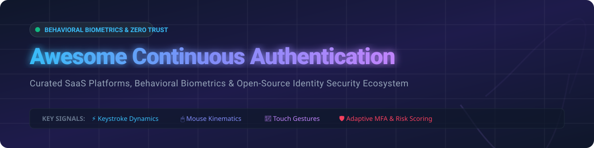

# 🛡️ Awesome Continuous Authentication

  

  
  
  
  

---

## 📌 Overview & Ecosystem Intelligence

**Curated list of Continuous Authentication platforms, SaaS biometrics solutions, and open-source GitHub projects.** 

Continuous authentication verifies user identity persistently throughout an active session rather than relying solely on point-in-time login credentials. By combining real-time behavioral dynamics (keystroke timing, mouse kinematics, touch gestures), device context, and risk scoring algorithms, continuous authentication prevents account takeovers (ATO), session hijacking, and social engineering fraud.

### 📊 Sector Market Size & Industry Dynamics

> [!NOTE]
> **Market Size:** The global continuous authentication market is estimated at **$2.53 Billion (2026)** and is projected to reach **$6.33 Billion by 2031** at a CAGR of **20.13%**.
> 
> **Market Structure:** The sector exhibits **moderate concentration with accelerating consolidation**. While specialized behavioral biometrics startups drive innovation, major enterprise Identity Fabric providers (Visa, LexisNexis, Okta, IBM, SecureAuth) are actively acquiring niche pioneers (e.g., Visa acquiring BioCatch for $2.4B, LexisNexis acquiring BehavioSec) to offer all-in-one risk-based identity platforms.

---

## 📑 Table of Contents

- [🛡️ SaaS & Enterprise Hosted Platforms](#-saas--enterprise-hosted-platforms)
- [💻 Open-Source GitHub Projects](#-open-source-github-projects)
- [🤝 How to Contribute](#-how-to-contribute)
- [☕ Support & Sponsorship](#-support--sponsorship)
- [📈 Star History](#-star-history)
- [⚠️ Disclaimer](#%EF%B8%8F-disclaimer)

---

## 🛡️ SaaS & Enterprise Hosted Platforms

The enterprise continuous authentication landscape features commercial vendors delivering production-grade accuracy, FIDO certification, enterprise IAM integrations, and passive behavioral fraud prevention.

*Sorted by Valuation / Annual Revenue (Descending)*

| Company / Product 🏢 | Valuation / Revenue 💰 | Starting Price 💵 | Free Tier / Trial Limits ⏳ | Key Features & Architecture ⚡ |
| :--- | :--- | :--- | :--- | :--- |
| **[BioCatch](https://www.biocatch.com/)** | **$2.4 Billion** *(Acquired by Visa in Aug 2026)* / **$185M+ ARR** | Custom Enterprise Tier (Contact Sales) | **No Free Trial** (Enterprise PoC demo by request) | Industry leader protecting 1.8B devices & 760M users. Analyzes mouse/touch dynamics, device telemetry, and application behavior to intercept scam/ATO fraud upstream. |
| **[Silverfort](https://www.silverfort.com/)** | **~$1.0 Billion** / **~$82M ARR** | Custom Enterprise Pricing (Per User / Mo) | **No Free Trial** (Offers free Active Directory Security Readiness Assessment) | Unified Identity Protection & Identity Graph. Extends continuous risk-based MFA inline across hybrid AD, legacy servers, VPNs, and AI workload identities. |
| **[Callsign](https://www.callsign.com/)** | **~$691.7 Million** / **~$50M–$60M Revenue** | Custom Enterprise Quote (Volume-based) | **No Free Trial** (Zero-risk sandbox testing environment for enterprise POCs) | "Digital DNA" behavioral intelligence engine. Passive behavioral signal ensembling (keystroke, swipe, device position) with FIDO Alliance integration. |
| **[SecureAuth](https://secureauth.com/)** | **~$230M Raised** / **~$18M–$55M Revenue** | Custom Enterprise Contract (Predictable Annualized Pricing) | **No Free Trial** (Guided enterprise Proof-of-Concept trial available) | Continuous Identity Authority platform providing continuous session trust scoring, dynamic action-level access step-up, and air-gapped/hybrid cloud deployment. |
| **[BehavioSec](https://www.behaviosec.com/)** | **$50M–$100M** *(Acquired by LexisNexis Risk Solutions)* | Custom Enterprise Licensing | **No Free Trial** (Enterprise sandbox available via LexisNexis partnership) | Enterprise behavioral biometrics pioneer. Creates user behavioral profiles from input timing/gestures to detect malware, synthetic identities, and account takeover. |
| **[Plurilock](https://plurilock.com/)** | **~$12M–$14M Market Cap** / **~$34M–$61M CAD Rev** | Enterprise Custom Tier | **No Free Trial** (Demonstration & enterprise pilot upon request) | All-in-one Zero Trust identity platform combining continuous behavioral authentication (DEFEND), SSO, CASB, and DLP with multi-patented AI engine. |
| **[TypingDNA](https://www.typingdna.com/)** | Private SaaS | **$1.00 / user / month** (Pro Tier) | **Starter Plan Free Forever** (Up to **100 active users / month**, no credit card required) | AI-powered typing biometrics API. Achieves 99.69% accuracy for continuous 2FA/MFA, integrating natively with Okta, Microsoft Entra, Keycloak, and Ping. |
| **[Zighra](https://zighra.com/)** | Private SaaS | Custom Enterprise Quote | **Free Trial Available** (Direct website registration for platform sandbox) | Continuous MFA combining sensor analytics, mouse/touch biometrics, and task-based human verification. FIDO Certified with 360-degree personalized user models. |
| **[ThreatMark](https://www.threatmark.com/)** | Private SaaS | Custom Enterprise Pricing | **No Free Trial** (Direct enterprise demo & threat simulation) | ThreatMark Behavioral Intelligence platform. Analyzes 2B+ logins to detect Authorised Push Payment (APP) scams, copy-paste fraud, and remote coaching indicators. |
| **[IBM Verify](https://www.ibm.com/products/verify)** | enterprise Division (IBM Corp) | Resource Unit Based | **90-Day Full-Featured Free Trial** (Convertible to production environment) | Enterprise IAM & risk-based continuous access engine using AI to score device context and behavioral risks with visual Flow Designer orchestration. |

---

## 💻 Open-Source GitHub Projects

The open-source ecosystem provides transparent frameworks, research tools, and local-first implementations for continuous identity verification, keystroke dynamics, and behavioral analytics.

*Sorted by GitHub Stars_Count (Descending)*

| Repository 📦 | GitHub_Stars ⭐ | License 📜 | Description & Technical Focus 🛠️ |
| :--- | :--- | :--- | :--- |
| **[nileshprasad137/keystroke-dynamics-datagen](https://github.com/nileshprasad137/keystroke-dynamics-datagen)** |  | MIT | Keystroke timing dataset generation & feature extraction framework for Linux and macOS research in continuous authentication. |
| **[nganntk/BehaveFormer](https://github.com/nganntk/BehaveFormer)** |  | Academic / Open | Spatio-Temporal Dual Attention Transformer (STDAT) model for sensor-based time-series behavioral biometric continuous authentication. |
| **[fevra-dev/Kala](https://github.com/fevra-dev/Kala)** |  | MIT | Browser extension biometrics framework monitoring real-time typing rhythm and cursor kinematics for web session protection. |
| **[shaz-in-dev/BioKey](https://github.com/shaz-in-dev/BioKey)** |  | MIT | Lightweight typing biometrics API for continuous risk scoring, bot detection, and behavioral identity verification. |
| **[sadvik-asus/Neuro_Mimesis](https://github.com/sadvik-asus/Neuro_Mimesis)** |  | MIT | Cognitive identity verification system using mouse dynamics. Features Trust Score tracking and Active Defense Protocol (lockdown, webcam capture, cursor jamming). |
| **[rohan5163/AI-Based-Behavioral-Analytics](https://github.com/rohan5163/AI-Based-Behavioral-Analytics-Framework-for-Fraud-Detection-in-FinTech-Systems)** |  | Open-Source | Full-stack FinTech fraud detection engine combining CNN behavioral embeddings with Mahalanobis distance anomaly detection for login and transactions. |

---

## 🤝 How to Contribute

Contributions are welcome! Please follow these steps to add new projects or update existing information:

1. Fork the repository 🍴
2. Create your feature branch (`git checkout -b feature/add-new-tool`)
3. Add entries to `README.md` following the standard table schema
4. Submit a Pull Request with a short description of the changes 🚀

---

## ☕ Support & Sponsorship

If you find this continuous authentication catalog useful for your security research or enterprise identity stack, please consider supporting the project!

- 🌟 **Star the repository** to boost visibility
- 📢 **Share with cybersecurity colleagues** and identity architects
- ☕ **Buy me a coffee / Sponsor**: Support ongoing maintenance via [GitHub Sponsors](https://github.com/sponsors/ishandutta2007)

---

## 📈 Star History

---

## ⚠️ Disclaimer

- This catalog is community-curated for informational and educational purposes.
- Continuous authentication technologies collect behavioral biometrics; ensure enterprise compliance with GDPR, CCPA, and applicable user privacy regulations.
- Commercial trademarks and product names belong to their respective owners.
